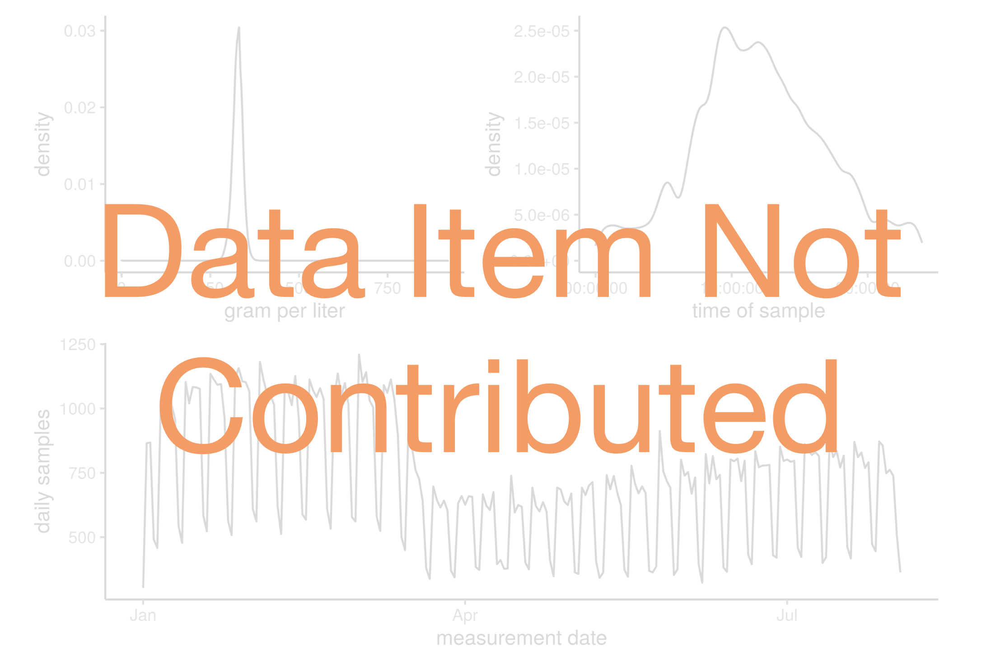

```{r}
current_concept <- {{x}}
current_name <- meas_dq$concept_name[meas_dq$concept_id == current_concept]
target_col <- meas_dq$target_column[meas_dq$concept_id == current_concept]

curr_title <- stringr::str_sub(current_name, 1, 30)
if (nchar(curr_title) >= 30) {
  curr_title <- paste0(curr_title, "...")
}
```

### `r paste0(current_concept, ": ", curr_title)`

```{r}
## Collect Just the working data we need

```
